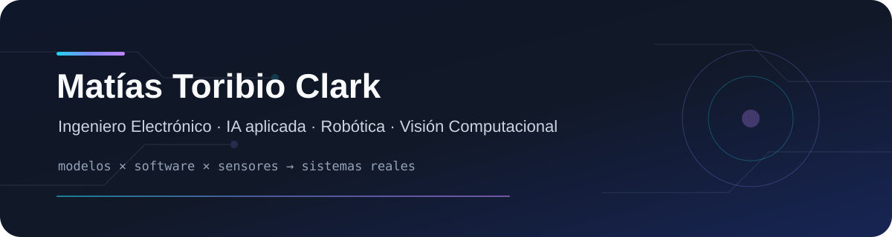
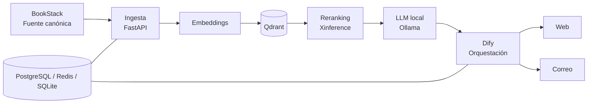

<p align="center">
  
</p>

<p align="center">
  <a href="https://www.linkedin.com/in/matiastoribioclark/"></a>
  <a href="mailto:matias.toribio@pucv.cl"></a>
  
</p>

<p align="center"><strong>Ingeniería Electrónica · Inteligencia Artificial aplicada · Robótica · Visión Computacional</strong></p>

---

## 👋 Sobre mí

Soy **Ingeniero Electrónico de la Pontificia Universidad Católica de Valparaíso (PUCV)** y trabajo en la intersección entre **IA, software y sistemas físicos**.

Me interesa especialmente la parte que viene después de la demo: convertir una idea o prototipo en un sistema que pueda **desplegarse, evaluarse, mantenerse y ser utilizado por otras personas**.

Durante 2025–2026 he trabajado principalmente en **arquitecturas RAG y LLMs locales, APIs, visión computacional, ROS2, SLAM/LIO, LiDAR y procesamiento de nubes de puntos**.

> **Mi enfoque:** construir sistemas útiles, trazables y reproducibles; no solo prototipos que funcionan una vez.

## ⚡ En qué estoy trabajando

<table>
<tr>
<td width="33%" valign="top">

### 🧠 IA institucional
Asistente académico **local-first** para la PUCV, con conocimiento institucional trazable, búsqueda semántica, reranking y atención multicanal.

**Python · FastAPI · Qdrant · Dify · Ollama · Xinference · Docker**

</td>
<td width="33%" valign="top">

### 🛰️ Mapeo 3D
Investigación aplicada con **Livox MID-360**, cámaras 360°, ROS2 y algoritmos LIO/SLAM para captura, trayectoria y reconstrucción de entornos.

**ROS2 · LiDAR · MCAP · Fast-LIO2 · Point Clouds**

</td>
<td width="33%" valign="top">

### 👁️ Visión aplicada
Pipelines de visión computacional para medición experimental, análisis de deformaciones, percepción robótica y monitorización.

**OpenCV · YOLO · Python · MATLAB · RGB/IR/Térmico**

</td>
</tr>
</table>

## 🧱 Una arquitectura que resume bastante bien lo que hago



## 🧰 Mi caja de herramientas

| Área | Tecnologías |
|---|---|
| **IA y conocimiento** | LLMs, RAG, embeddings, búsqueda vectorial, reranking, agentes, Qdrant, Dify, Ollama, Xinference |
| **Backend y plataforma** | Python, FastAPI, REST APIs, PostgreSQL, Redis, SQLite, Docker, Docker Compose, Linux |
| **Robótica** | ROS / ROS2, SLAM, LIO, LiDAR 2D/3D, IMU, fusión de sensores, MCAP |
| **Visión computacional** | OpenCV, YOLO, segmentación, detección, cámaras RGB, IR y térmicas |
| **Embebidos** | C/C++, ESP32, Arduino, Raspberry Pi |
| **Infraestructura** | NVIDIA GPU, inferencia local, Cloudflare, CI/CD, AWS, Azure |

## 🔬 Proyectos seleccionados

### 🧠 Asistente académico institucional — PUCV · 2026
Arquitectura RAG local-first construida para responder consultas utilizando información oficial de la universidad.

- BookStack como fuente canónica editable.
- Ingesta y sincronización incremental hacia Qdrant.
- Embeddings, recuperación semántica y reranking.
- Inferencia local y orquestación con Dify.
- Atención vía web y correo.
- Despliegue con Docker Compose sobre Linux.
- Corpus inicial de **124 PDF**, con **97 documentos incorporados** y más de **1.300 fragmentos recuperables**.

### 🛰️ Mapeo 3D multimodal de bajo costo · 2025–2026
Pipeline reproducible para captura y reconstrucción de espacios interiores utilizando **Livox MID-360**, cámara 360°, ROS2, MCAP y algoritmos LIO.

### 📐 Medición de deformación mediante visión computacional · 2026
Pipeline markerless para analizar videos experimentales, segmentar elementos estructurales, estimar desplazamientos y generar curvas de deflexión versus tiempo.

### 🦾 Brazo robótico de 6 GDL con reconocimiento de objetos · 2024
Proyecto de título que integra control robótico mediante ROS con percepción basada en YOLO.

### 👁️ Detección facial para robótica
➡️ **[Face_Detection_LAB_Robotica](https://github.com/M4tizinh0/Face_Detection_LAB_Robotica)**

## 🧭 Trayectoria

```text
2026        Ingeniería de IA aplicada · Asistente académico institucional · PUCV
2025        I+D y Visión Computacional · LTDIC · PUCV
2024–2025  Robótica y Visión / Materiales Granulares · PUCV
2024        Ingeniería Electrónica · Titulación PUCV
```

## 🧩 Cómo me gusta trabajar

- **Local-first cuando tiene sentido:** privacidad, control y costos predecibles.
- **Trazabilidad antes que magia:** saber de dónde salió una respuesta o resultado.
- **Reproducibilidad:** que un pipeline pueda ejecutarse de nuevo y entregar resultados comparables.
- **Ingeniería de extremo a extremo:** adquisición, procesamiento, backend, infraestructura, pruebas y documentación.
- **Herramientas antes que dogmas:** elegir tecnología por el problema, no por moda.

## 🎓 Más allá del código

- Instructor de un taller introductorio de **Inteligencia Artificial** en la Escuela de Ingeniería Eléctrica PUCV.
- Vicepresidente del **Centro de Alumnos de Ingeniería Electrónica PUCV**.
- Diplomatura en **Deportes Electrónicos y Videojuegos**, con formación en liderazgo de equipos, planificación y gestión de conflictos.

## 🌎 Idiomas

**Español** — Nativo  
**Portugués** — Avanzado  
**Inglés** — Intermedio, con lectura habitual de documentación técnica y papers

---

<p align="center"><strong>Construir algo que funciona es el comienzo. Lograr que siga funcionando es ingeniería.</strong></p>
<p align="center"><a href="https://www.linkedin.com/in/matiastoribioclark/">LinkedIn</a> · <a href="mailto:matias.toribio@pucv.cl">Contacto</a></p>
